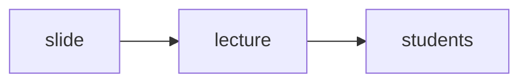

```mermaid
flowchart LR
    slide --> lecture --> students
```

> On the website, lectures don't load Mermaid, so this shows as text (the lecture has `mermaid: true`, which only exercises use). The Learning Zone package draws it.
